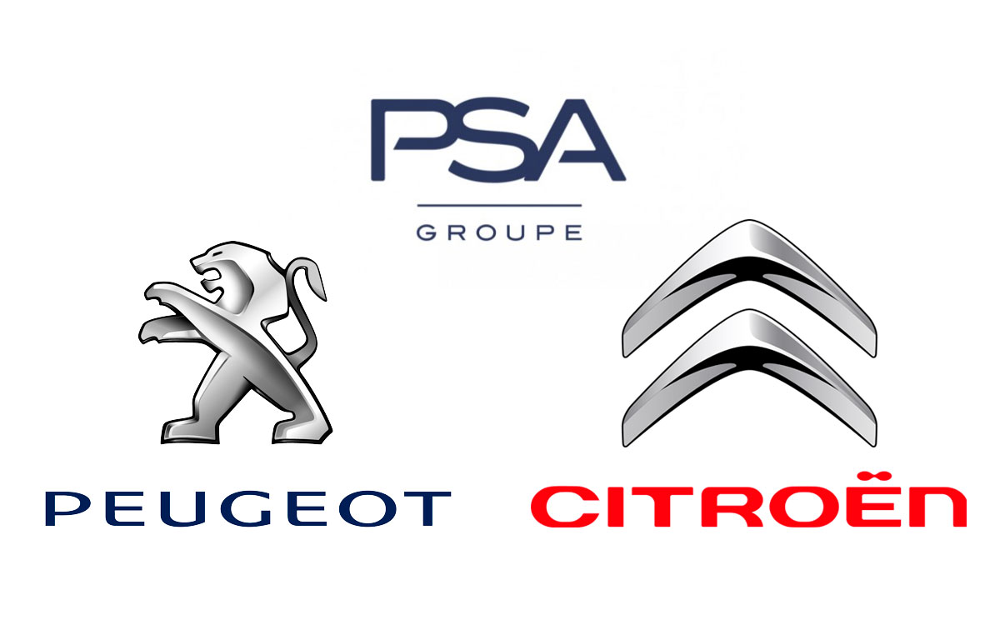

<h1 align="center">
    
</h1>

<h3 align="center">
  Inovatend: iOS Application
</h3>

“Não espere para plantar, apenas tenha paciência para colher”!</blockquote>

  

  

  

  

  

  

  <a href="#rocket-descrição">Descrição</a>&nbsp;&nbsp;&nbsp;|&nbsp;&nbsp;&nbsp;
  <a href="#computer-tecnologias-e-ferramentas">Tecnologias e Ferramentas</a>&nbsp;&nbsp;&nbsp;|&nbsp;&nbsp;&nbsp;
  <a href="#iphone-screenshot">Screenshot</a>&nbsp;&nbsp;&nbsp;|&nbsp;&nbsp;&nbsp;
  <a href="#movie_camera-preview">Preview</a>&nbsp;&nbsp;&nbsp;|&nbsp;&nbsp;&nbsp;
  <a href="#memo-licença">Licença</a>

## :rocket: Descrição

Inovatend é uma aplicação desenvolvida durante um desafio (semelhante a um hackathon) proposto pelo Grupo PSA Citroen. O tema principal foi o lançamento do Citroen Cactus, teriamos que desenvolver uma solução para que novos clientes venham conhecer o novo modelo.

Nossa solução foi criar um quiz onde é possível o cliente fornecer algumas informações para a loja, criando o primeiro engajamento. Após responder todas as perguntas, o cliente tem a oportunidade de ver o carro através de um modelo 3D, e ver como o carro fica na garagem, além de conseguir alterar a cor.

Para desenvolver o aplicativo foi usado a biblioteca: [ARKit](https://developer.apple.com/augmented-reality/) (Biblioteca de realidade aumentada da Apple).

## :computer: Tecnologias e Ferramentas

- [Swift](https://www.apple.com/br/swift/)
- [ARKit](https://developer.apple.com/augmented-reality/)

## :movie_camera: Preview

## :iphone: Screenshot

<h2 align="center">
  
  
  
  
  
  
  
  
</h2>

## :memo: Licença

Esse projeto está sob a licença MIT. Veja o arquivo [LICENSE](LICENSE) para mais detalhes.

---

Projeto desenvolvido by Igor Clemente :wave:
